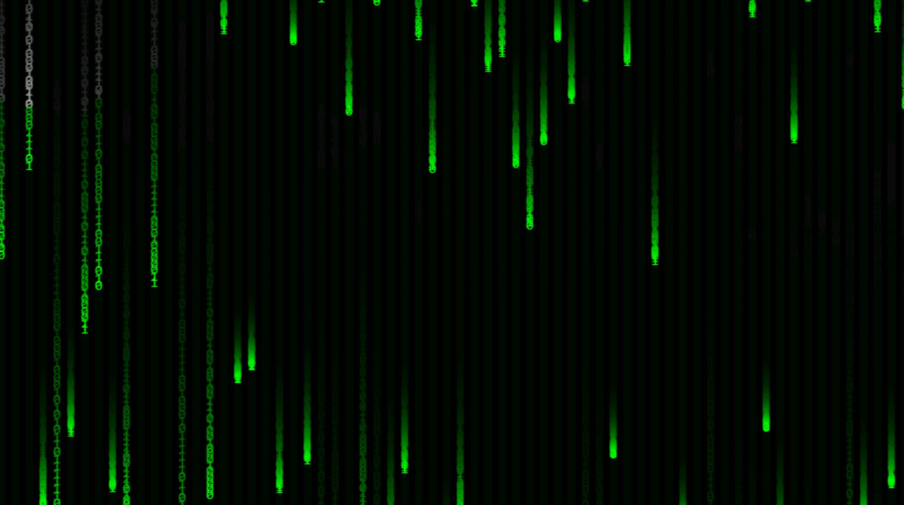

# Matrix Rain Animation

A simple and elegant Matrix-style digital rain animation implemented in pure HTML and JavaScript. The animation creates the iconic cascading green characters effect from "The Matrix" movie series.

## Features

- Pure JavaScript implementation - no external dependencies
- Customizable characters and colors
- Responsive design that adapts to window size
- Smooth animation using HTML5 Canvas

## Usage

Simply open `index.html` in a web browser to see the animation. The effect will automatically adjust to your browser window size.

## License

MIT License - feel free to use and modify as you like!
